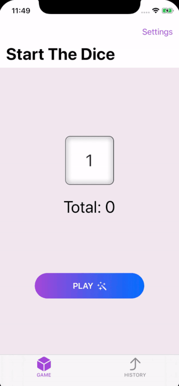

# RollDice

The app that helps users roll dice then store the results they got

## Challange

1. Let the user customize the dice that are rolled: how many of them, and what type: 4-sided, 6-sided, 8-sided, 10-sided, 12-sided, 20-sided, and even 100-sided.
2. Show the total rolled on the dice.
3. Store the results so they are persistent.
4. Add haptic feedback when dice are rolled.
5. Make the value rolled by the dice flick through various possible values before settling on the final figure.

